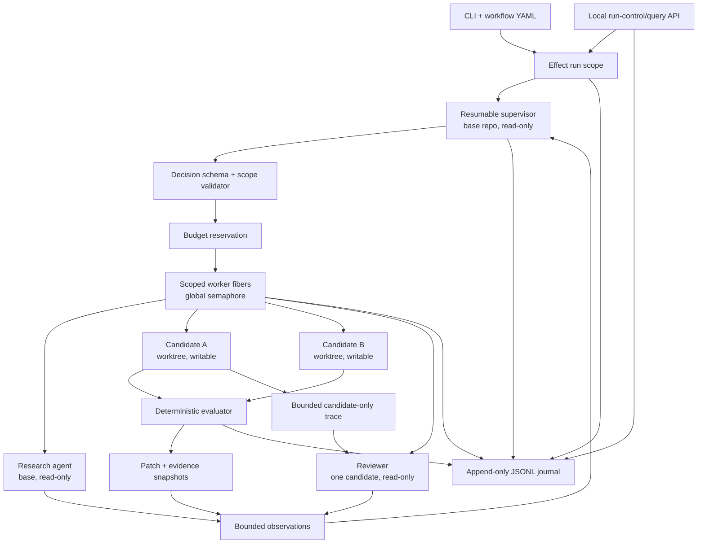

# Architecture

The package root is domain-neutral. Its composition hierarchy is
`AgentBlock -> AgentMember -> AgentTeam -> AgentOrganization`: a block has one explicit owner, a
member belongs to one team, and teams form a roster. Agent Blocks validates unique IDs and exposes
flattened assignments; consumers define team meaning, permissions, sequencing, and runtime policy.

The scoped-worktree template below is one opinionated consumer of the package, not the meaning of
the generic root.

The harness separates a deterministic control plane from an interchangeable model-turn runtime.
The selected runtime can reason, inspect, and edit inside a supplied scope; it cannot allocate scopes, increase
limits, select arbitrary roles, run evaluator commands, or decide how state is persisted.



## Supervisor loop

Every supervisor turn must return one schema-constrained decision:

- `continue`: one or more assignments, no selected candidate;
- `accept`: no assignments, one existing candidate selected;
- `stop`: no assignments and no selected candidate.

The harness rejects decisions that reference unknown roles, duplicate an agent in one batch,
change an existing agent's role or target, exceed role instances/turns, or violate scope semantics.
When evaluation is configured, a candidate cannot be accepted until its latest evaluation passes.

## Logical subagents

An `agentId` is durable within one run. Its first assignment binds:

- the configured role and role kind;
- the working directory and sandbox mode;
- a candidate ID or review target, if applicable;
- a runtime session/thread ID after the first successful turn.

Later assignments to the same ID resume that runtime session. The Codex and OpenCode adapters both
retain the original working directory and sandbox/policy, which matches the harness's immutable
binding rule.

Workers cannot create other workers. Only the supervisor can request a new logical agent, and the
deterministic validator decides whether that request is legal.

## Effect ownership

- The outer `Effect.scoped` lifetime owns candidate worktrees through `acquireRelease`.
- Each worker batch has an inner scope and starts one `forkScoped` fiber per assignment.
- Candidate/research work in a batch completes before its pinned review work. Candidate traces,
  patches, and deterministic evaluations are therefore current before review starts, without a
  candidate racing the reviewer over trusted audit state.
- A run-wide `Semaphore` limits concurrent runtime child processes.
- Child processes are wrapped in `Effect.tryPromise`; interruption propagates through its abort
  signal and terminates the child.
- A `Ref` atomically accounts for rounds, logical agents, worker turns, and budget-charged tokens (non-cached input plus output). Raw and cached usage remain durable event fields.
- `timeoutOrElse` places a hard wall-clock bound around the complete supervisor loop.

Closing a worker-batch scope interrupts unfinished workers. Closing the run scope removes candidate
worktrees unless `--keep-worktrees` was explicit.

The low-level no-shell process, bounded-output, timeout, and cancellation implementation comes from
`@agentic-orch/node-guardrails/process`. Agent Blocks wraps that neutral Promise/`AbortSignal` contract with Effect
and retains ownership of runtime events, budgets, retries, lifecycle scopes, and public errors.

On POSIX, each child leads an isolated process group. A timeout, abort, or output-limit failure sends
graceful and then forced termination to that group, including descendants that retain inherited
pipes. On Windows, Node.js has no portable process-group or job-object equivalent, so cleanup is
limited to the direct child and Agent Blocks's pipe endpoints; descendants may continue running. Even the
POSIX mechanism is bounded lifecycle cleanup, not a security sandbox: hostile code can attempt to
escape the group or use other host resources. Strong containment must come from an external OS
sandbox, container, VM, or Windows job-object supervisor.

## Persistence

Each run directory contains:

```text
runs/<run-id>/
├── events.jsonl
├── summary.json
├── artifacts/
│   └── <sha256>.patch
├── candidates/
│   └── <candidate-id>.patch  # latest compatibility copy
└── schemas/
    ├── agent-report.json
    └── supervisor-decision.json
```

`events.jsonl` is append-only and canonical. Every new record has schema version 1, the run ID, a
monotonic sequence, and an ISO timestamp. The decoder also accepts legacy unversioned records,
rejects corrupt or non-monotonic complete records, and tolerates only an incomplete final line
during a concurrent append.

Allocation creates the run directory and appends `run.created` before workspace preflight. A
successful preflight is followed by `run.started`; typed failures and cooperative Effect fiber
interruption append terminal `run.failed` records. This makes queued, running, failed, and interrupted
runs queryable without `summary.json`. `summary.json` remains the validated compatibility artifact
for accepted, stopped, and budget-limited runs.

The private journal retains normalized lifecycle records and original runtime JSONL events tagged
with logical agent and session/thread IDs. `inspectRunState`, `listRuns`, and `readRunEvents` replay it into a safe
projection. Public event reads omit raw runtime events and recursively remove prompts, session/thread
IDs, host paths, worktree locations, and evaluator output. Newest-first listing uses creation time and
the run ID as a deterministic tie-breaker.

New records use `runtime.raw_event` with the non-secret adapter ID. The decoder and public filter
continue to recognize legacy `codex.raw_event` records. `run.started` also captures the runtime
adapter, binary label, user-config isolation flag, output cap, and short tool-policy label; it never
captures credentials or command arguments.

Private `harness.private.*` records retain candidate trace and audit-materialization provenance but
are omitted entirely from public event reads. Neither the public event projection nor the compact run
view contains the audit trace path or contents.

## Trace-based review audit

Every candidate turn contributes only to that candidate's trace: turn number, assignment, exact
harness prompt, structured final output, usage, and raw runtime events in runtime order. Supervisor,
research, review, and other candidates' events are never copied into the bundle.

Immediately before a pinned review, the harness recreates
`.harness-audit/trace.jsonl` inside the target worktree. Versioned JSONL records include the latest
evaluation and immutable patch artifact ID/digest. Bundles have a fixed 1 MiB cap; an oversized trace
keeps a prefix plus snapshot provenance and records both header and truncation metadata explicitly.
Evaluator stdout/stderr fields have their own explicit byte-truncation metadata.

Review prompts identify the relative trace path and configured evaluator argv. They require an
end-to-end candidate and trace inspection, an independent evaluator rerun when configured, and an
explicit audit for hardcoding, cache or grader detection, environment/path tricks, and unsupported
claims. Reviewers must inspect the header/truncation metadata first and report degraded coverage
rather than calling a truncated trace complete. Review agents remain bound to the target worktree
with a read-only sandbox and cannot edit or select candidates.

## Candidate transport

Candidate worktrees start detached at the base HEAD. Patch capture temporarily stages all changes,
including new, deleted, executable, and binary files, writes `git diff --cached --binary`, and then
unstages without changing the working tree.

`.harness-audit/` is reserved ephemeral harness state. The harness creates or recreates it before
candidate and review turns, requires candidates to leave the empty reserved directory untouched, and
rejects tracked entries, symlinks, deletions, or candidate-created contents. Patch staging excludes
the path defensively, so neither compatibility patches nor content-addressed artifacts can contain
the review bundle.

Each capture is also published immutably as `artifacts/<sha256>.patch`. The shared bounded CAS
primitive owns byte hashing, no-clobber publication, and corrupt-occupant detection; Agent Blocks owns the
20 MiB Git-output bound, `.patch` naming, event schema, and private run-directory policy. An
`artifact.published` event records the content digest, byte size, media type, and candidate ID; the following
`candidate.snapshot` references that artifact ID. The mutable `candidates/<candidate-id>.patch` file
continues to hold the latest patch for the legacy summary and CLI apply path. There is intentionally
no arbitrary-path artifact reader in this release.

`--apply` checks that the base HEAD is unchanged, requires a clean base, runs `git apply --check`,
and only then applies the accepted patch. The default never touches the base working tree.

## Process and crash semantics

Release 0.1 is a single-process local harness. Journal append serialization is process-local, and
there is no cross-process writer lease, global admission controller, or automatic run resumption.
Caller-provided run IDs are allocated with an exclusive directory creation so an existing ID is not
reused, but separate processes must not share active ownership of one harness home.

Cooperative fiber cancellation runs the harness finalizer and records `run.failed` with interruption
metadata after scoped worktree cleanup. A non-cooperative process death such as `SIGKILL`, power loss,
or storage failure cannot append a terminal record and may leave the last durable projection queued or
running. On restart, the harness replays durable records only; it never infers continuation from model
prose or runtime session files. A future release needs a writer lease/recovery protocol to identify and mark
hard-crash orphans safely.
